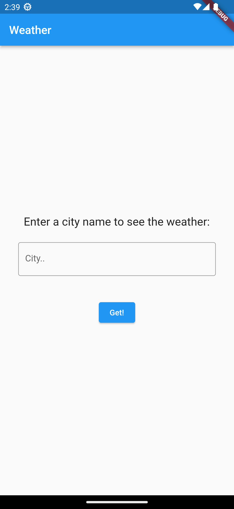
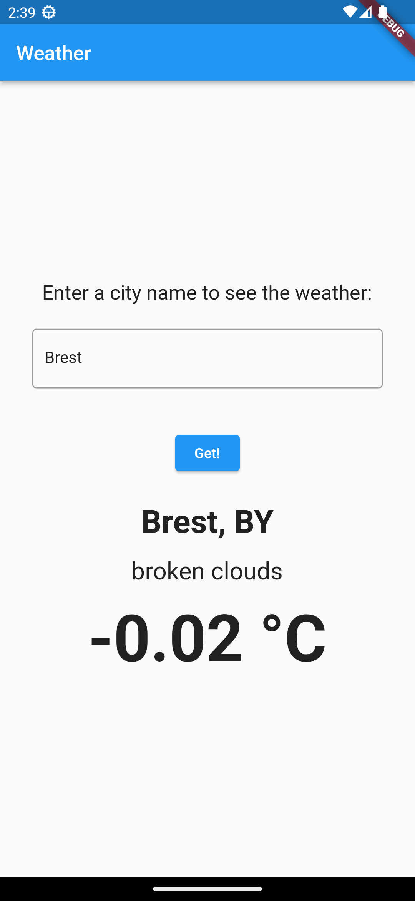

A weather application, that is implemented using two architectures.

## Architectures.

### MVC.

```
Model-View-Controller.
```

### MVVM.

```
Model-View-ViewModel.
```

## Review.

### MVC.

<table>
  <tr>
    <td>Photo 1.</td>
    <td>Photo 2.</td>
  </tr>
  <tr>
    <td></td>
    <td></td>
  </tr>
 </table>

### MVVM.

<table>
  <tr>
    <td>Photo 1.</td>
    <td>Photo 2.</td>
  </tr>
  <tr>
    <td></td>
    <td></td>
  </tr>
 </table>
